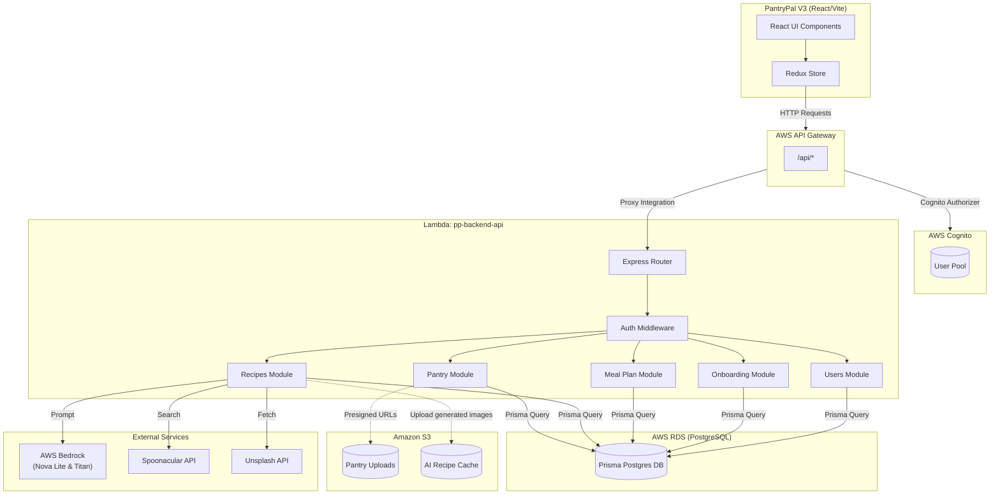
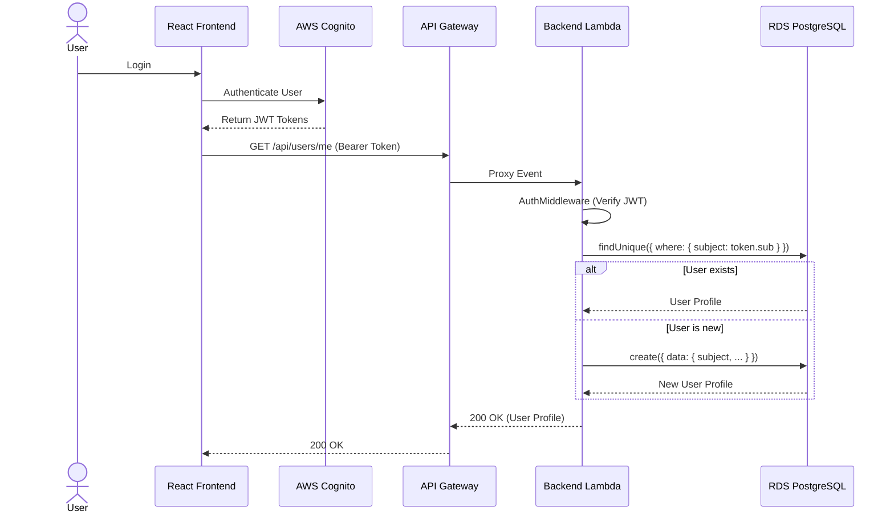
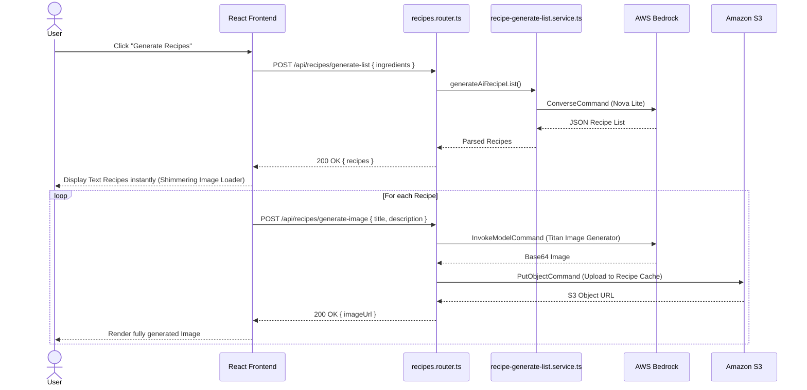
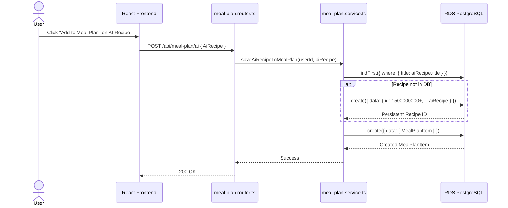

# PantryPal Backend (`pp-backend`) — Codebase Report

**Group #3 | PROG8950 Capstone | Conestoga College (Winter 2026)**

---

## Tech Stack

| Layer | Technology |
|---|---|
| Runtime | Node.js (TypeScript) |
| Framework | Express.js wrapped with `@vendia/serverless-express` |
| Database | PostgreSQL (Amazon RDS) |
| ORM | Prisma Client v6 |
| Authentication | AWS Cognito (JWT Validation Middleware) |
| Infrastructure as Code | Terraform (v1.5+) |
| Storage | Amazon S3 (Pantry Uploads & AI Image Cache) |
| External APIs | Spoonacular API (Recipes), Unsplash/Pexels API (Images) |
| AI / LLM | AWS Bedrock (`amazon.nova-lite-v1:0`, `amazon.titan-image-generator-v1`) via AWS SDK v3 |

---

## Architecture Diagram

---

## Sequence Charts

### 1. User Authentication & Profile Lookup

### 2. AI Recipe & Image Generation (Async Flow)

### 3. Add AI Recipe to Meal Plan

